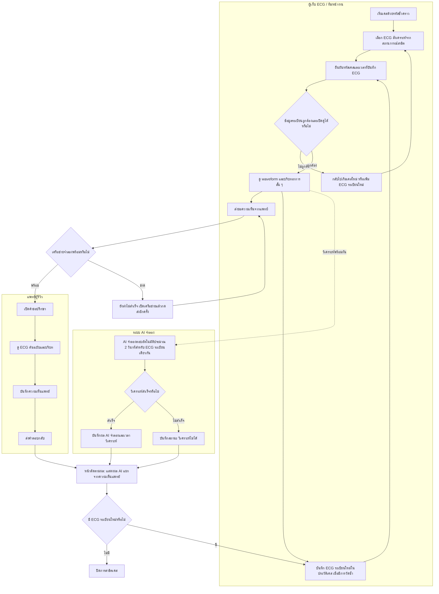

# Flowchart: ECG AI Triage Prototype

เอกสารนี้อธิบาย user journey สำหรับต้นแบบ 3 ขั้นตอนทีมหน้างานและมุมมองแพทย์แยกบทบาท เพื่อให้ทีมและแพทย์เห็นการไหลของข้อมูลตั้งแต่รับ ECG จนได้รับความเห็นจากแพทย์

## ขอบเขตของต้นแบบ

- ใช้ข้อมูลผู้ป่วยสมมติและ waveform **สังเคราะห์** เท่านั้น JSON ตัวอย่างกำหนดสถานการณ์ ไม่ใช่ไฟล์สัญญาณ ECG จริง
- ผล AI เป็นข้อมูลจำลอง ไม่ได้เรียกโมเดลจริง และไม่ใช้เพื่อวินิจฉัยหรือสั่งการรักษา
- ไม่มีการเชื่อมต่อเครื่อง ECG จริง ระบบแจ้งเตือนจริง หรือการส่งข้อความจริง
- รองรับ ECG หนึ่งระเบียนต่อหนึ่งรายการ พร้อมประวัติ ECG หลายครั้งภายในเคสเดียว
- ผู้ใช้สามารถส่งขอความเห็นจากแพทย์ได้โดยไม่ต้องรอผล AI

## หน้าจอของต้นแบบ

| หน้าจอ | จุดประสงค์ |
| --- | --- |
| 1. รับ ECG | สร้างเคสชั่วคราว เลือกสถานการณ์สาธิตหรือ JSON ตัวอย่าง และบันทึกอาการสั้น ๆ |
| 2. ยืนยันและส่งปรึกษา | ตรวจสอบรหัสเคส เวลาที่บันทึก ECG และ waveform ก่อนส่งให้แพทย์ |
| 3. ผลประเมิน | แสดงสถานะวิเคราะห์และผล AI จำลองของ ECG ระเบียนนั้น แยกจากความเห็นแพทย์ |
| 4. มุมมองแพทย์ | ดู ECG และข้อมูลประกอบ บันทึกความเห็น แล้วส่งคำตอบกลับ |

## การไหลของงาน

## หลักการออกแบบที่ต้องคงไว้

### 1. ผล AI ไม่ปิดกั้นการขอความเห็นแพทย์

เมื่อยืนยันเคสและเวลาแล้ว ผู้ใช้จำลองส่ง ECG ให้แพทย์รีวิวได้ทันที โดย AI จำลองตอบอัตโนมัติประมาณ 2 วินาทีหลังรับ ECG การส่งปรึกษาจึงไม่ขึ้นกับผล AI และไม่มีการส่งให้แพทย์จริง

### 2. ผลของแต่ละ ECG ต้องไม่ปะปนกัน

ผล AI ความเห็นแพทย์ และสถานะของระบบต้องผูกกับ ECG ระเบียนเดียว พร้อมเวลาเก็บ ECG ที่มองเห็นได้เสมอ หากมีการวัดใหม่ ให้เพิ่มเป็นระเบียนใหม่ในประวัติเคส ไม่เขียนทับผลของระเบียนเดิม

### 3. แยกสถานะ AI ออกจากความเห็นแพทย์

หน้าติดตามผลต้องมีอย่างน้อยสองส่วน:

- **ผลประเมินจาก AI (จำลอง):** กำลังวิเคราะห์ / วิเคราะห์สำเร็จ / วิเคราะห์ไม่ได้ และกลุ่มผลลัพธ์สาธิต
- **ความเห็นแพทย์:** ยังไม่รีวิว / กำลังรีวิว / ส่งความเห็นแล้ว พร้อมผู้รีวิวและเวลา

หากแพทย์เห็นต่างจาก AI ให้เก็บทั้งสองรายการไว้คู่กันโดยไม่แก้ไขผล AI เดิม

### 4. กรณีล้มเหลวต้องเดินต่อได้

JSON ตัวอย่างที่อ่านไม่ได้หรือไม่ตรงรูปแบบจะแสดงข้อผิดพลาดก่อนเริ่มเคส หากข้อมูลเคสไม่ตรงให้เริ่มเคสใหม่ หาก AI จำลองวิเคราะห์ไม่ได้ยังส่ง ECG ให้แพทย์สมมติรีวิวได้ หากเครือข่ายจำลองขาดต้องขึ้นว่ายังส่งไม่สำเร็จ ผล AI ที่ไม่พร้อมไม่ใช่เหตุให้สรุปว่าเคสปกติ

## แยกสองบริบทการใช้งาน

| บริบท | การมองเห็นผล AI | เป้าหมาย |
| --- | --- | --- |
| การใช้งานทางคลินิกในอนาคต | แพทย์อาจเห็นผล AI หลังระบบวิเคราะห์เสร็จ โดยยังแยกจากความเห็นแพทย์ | สำรวจว่า AI เป็นข้อมูลประกอบการตัดสินใจได้อย่างไร |
| การอ่านแบบอิสระเพื่อการวิจัย | **เลือกโหมดก่อนเริ่มเคสและล็อกโหมด ซ่อนผล AI/JSON ทุกหน้าจนแพทย์ส่งความเห็นของตนเองแล้ว** | ลดการชี้นำคำตอบของแพทย์ในการเปรียบเทียบผลการอ่าน |

เดโมหน้าเดียวไม่มี authentication และผู้สาธิตเป็นผู้กำหนด scenario จึงไม่ใช่ระบบ blinded study จริง ดู [API contract](ai-api-contract.md) สำหรับการแยกสิทธิ์และ inference ในอนาคต

ต้นแบบนี้ใช้เพื่อสนทนาและรับข้อเสนอแนะด้าน workflow เท่านั้น ไม่ใช่ข้อกำหนด clinical protocol หรือระบบใช้งานจริง.
